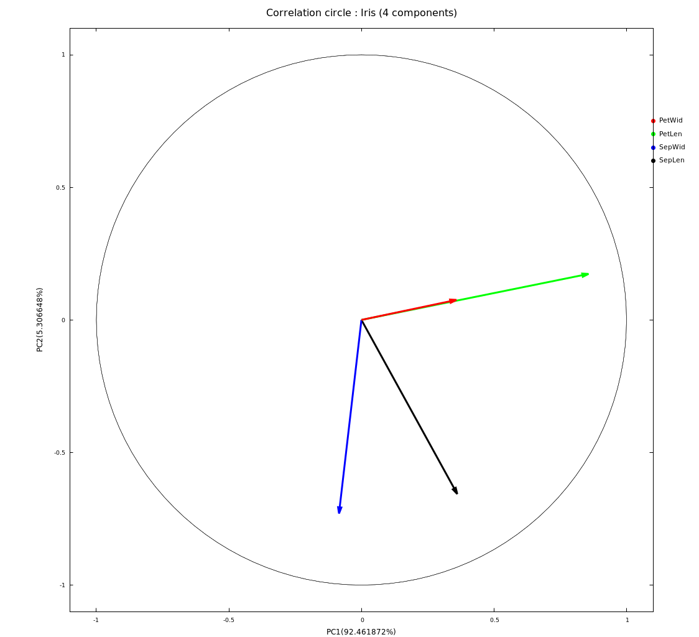
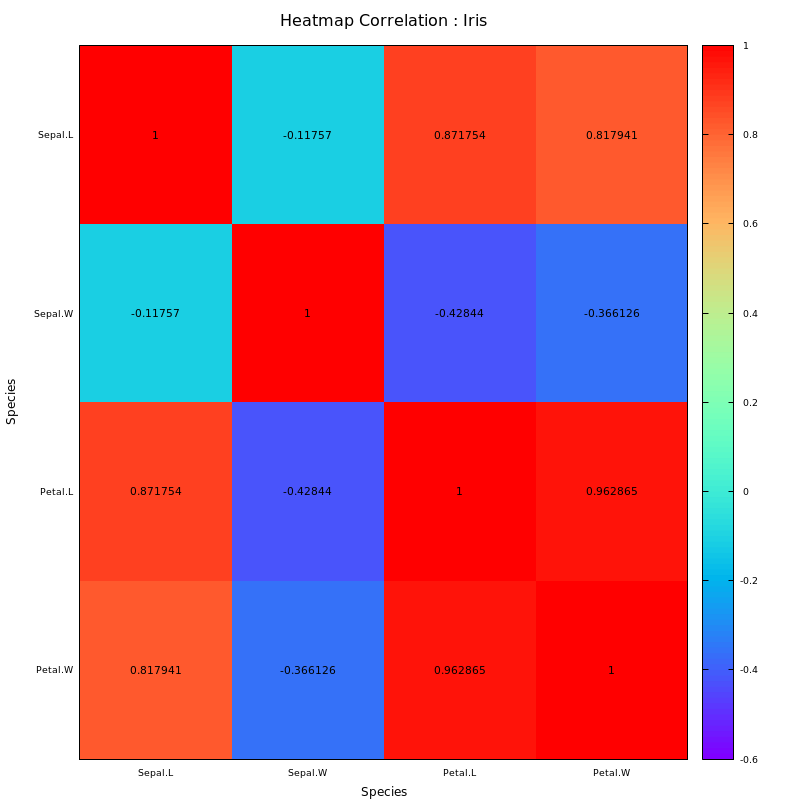
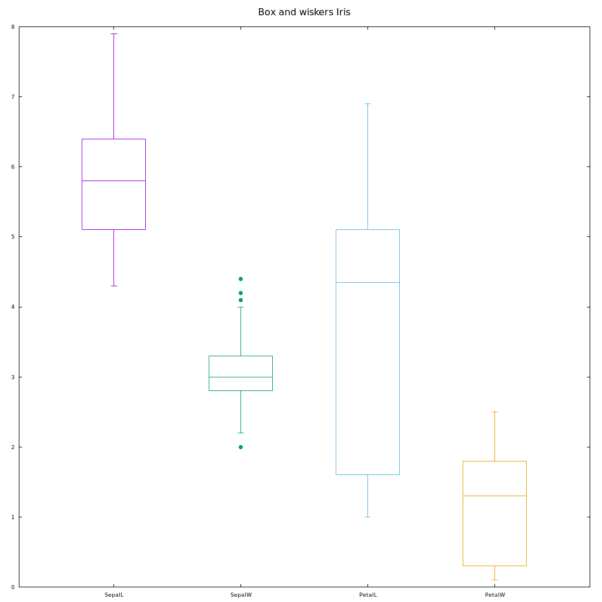

# Pca

May be you are familiar with spreadsheets and dynamic cross tables tools to compare columns behaviours as sum,means...but what happens if you have about a thousand columns, you will need a more synthetic view of your datas.  

**Pca**(Principal Component Analysis) is a method attached to Quantitative analysis (QA) branch.  

It performs multidimensional analysis (Rk space), considering "Components" as columns of a datasets.  

Behaviours are calculated as covariance or correlation and represented as 2d square matrix.   
Many of these features yet exists in Python modules, but python may be slow on wide datasets.


The c++ code is a backend to handle large datasets with a best time response.  
Python part [Docker image](./script/python/README.md) can be used to plot and or to crosscheck results directly or from the backend.  

[Matlab/Octave](./script/matlab/README.md) part is available to crosscheck, some 
scripts can be used to generate graphics.

## Purpose

Demistify PCA to let exploration as simple as possible for c/c++ devs.

## Lexical

Pre-processing
* Covariance matrix is the dispersion matrix of a dataset.  
* Correlation matrix is a covariance scaled matrix (identified by diagonal set to 1).  

Svd (Single values decomposition) is the Eigen process applied to a matrix, it returns values and vectors.

Consider 2 forms of Pca
* covariance based  (Svd on unscaled matrix).
* correlation based (Svd on scaled matrix).

As you may notice 
* covariance is lossless with a wide dispersion.
* correlation is lossy with scaled dispersion.

So what should I use cov or cor ?  
When using dataset with columns values of same units use covariance else use correlation.  
So method to use will depend on the nature of your dataset.

## Features

### Calculus
* Covariance
* Correlation
* Pca
* Explained variance
* Projection

### Graphics
* Scatter
* Correlation circle
* Heatmap correlation
* Dataset boxes and wiskers ( [What does a box plot tell you?](https://www.simplypsychology.org/boxplots.html) )

## References

### PCA

#### Presentation
 * [Jérome Pages - AgroCampus (fr)](https://www.youtube.com/watch?v=uV5hmpzmWsU)

#### Tools

* [Online Statistics Calculator (en)](https://datatab.net/statistics-calculator/factor-analysis)
* [Principal Component Analysis and Linear Discriminant Analysis with GNU Octave (en)](https://www.bytefish.de/blog/pca_lda_with_gnu_octave.html)

### Pca explaination

* [Math explained PCA](https://www.youtube.com/watch?v=FgakZw6K1QQ)

#### Interpretation
* [Interprétation d'une ACP sur les variables (fr)](http://www.jybaudot.fr/Analdonnees/acpvarres.html)
* [L'analyse en composante principale (fr)](https://dridk.me/analyse-en-composante-principale.html)

#### Questions
 * [Best way to let pca be normalized (en)](https://stats.stackexchange.com/questions/53/pca-on-correlation-or-covariance)

## Fixtures (datasets)
Hereby
* [2x12 inline](src/main.cpp)
* [4x12 pop(gender/salary/age/weight) csv](script/matlab/gsaw.csv)
* [6x23 bovins(vif/carcasse/quality/total/gras/os) csv](script/matlab/bovin.csv)
* [4x150 iris species(sepallength/sepalwidth/petallength/petalwidth) csv](script/python/workspace/species.csv)

Sources  
* [Numerical Example](https://www.itl.nist.gov/div898/handbook/pmc/section5/pmc552.htm)
* [2x12 (age/weight)](https://datatab.net/statistics-calculator/factor-analysis)
* [bovins (@see above)](https://cermics.enpc.fr/scilab_new/site/Tp/Statistique/acp/acp.html)
* [iris species](https://datahub.io/machine-learning/iris/r/1.html)

## Requirements

* [CMake](https://cmake.org/). 
* C++ compiler, here g++, [howto change it](https://stackoverflow.com/questions/45933732/how-to-specify-a-compiler-in-cmake) in [CMakeLists.txt](CMakeLists.txt). 
* [Alglib](https://www.alglib.net) included in src. 
* [Boost lib](https://www.boost.org/). 
* [Gnuplot-iostream](https://github.com/dstahlke/gnuplot-iostream).
* [Octave](https://www.gnu.org/software/octave/) or [Matlab](https://mathworks.com/products/matlab.html).
* [Doxygen](https://www.doxygen.nl) for doc generation.

## Build

```
./build.sh
```

## Run

```
./build/pca
```

## Debug

### Gnuplot

```
GNUPLOT_IOSTREAM_CMD=">dbgscript.gp" ./build/pca
```

## Sample output

Related to
* [iris species dataset](https://datahub.io/machine-learning/iris/r/1.html) input source.
* Python script [species.py](./script/python/workspace/species.py)

### Console

```
Fixture csv iris species 4x150
	Fixture Dataset

	5.100000	3.500000	1.400000	0.200000
	4.900000	3.000000	1.400000	0.200000
	4.700000	3.200000	1.300000	0.200000
	4.600000	3.100000	1.500000	0.200000
	5.000000	3.600000	1.400000	0.200000
	         ...
	Covariance

	0.685694	-0.042434	1.274315	0.516271
	-0.042434	0.189979	-0.329656	-0.121639
	1.274315	-0.329656	3.116278	1.295609
	0.516271	-0.121639	1.295609	0.581006

	Correlation

	1.000000	-0.117570	0.871754	0.817941
	-0.117570	1.000000	-0.428440	-0.366126
	0.871754	-0.428440	1.000000	0.962865
	0.817941	-0.366126	0.962865	1.000000

	Eigen vectors

	0.361387	-0.656589	0.582030	0.315487
	-0.084523	-0.730161	-0.597911	-0.319723
	0.856671	0.173373	-0.076236	-0.479839
	0.358289	0.075481	-0.545831	0.753657

	Eigen values

	4.228242	0.242671	0.078210	0.023835
	
	Explained variance
	
	0.924619	0.053066	0.017103	0.005212
	
	Projected matrix

	2.818240	-5.646350	0.659768	-0.031089
	2.788223	-5.149951	0.842317	0.065675
	2.613375	-5.182003	0.613952	-0.013383
	2.757022	-5.008654	0.600293	-0.108928
	2.773649	-5.653707	0.541773	-0.094610
	         ...
```
### Graphics

#### Scatter


#### Correlation circle



#### Heatmap correlation 



#### Dataset box and wiskers



## Testing

```
./test.sh
```

## Doc

From root project.

```
doxygen doc/pcasvd.doxygen
```

Doc will be genrated in doc/html folder.