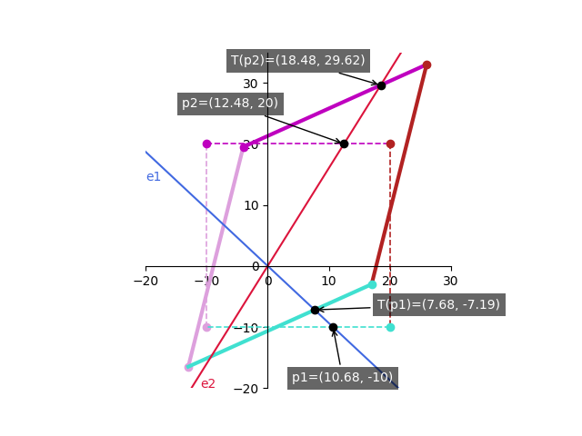
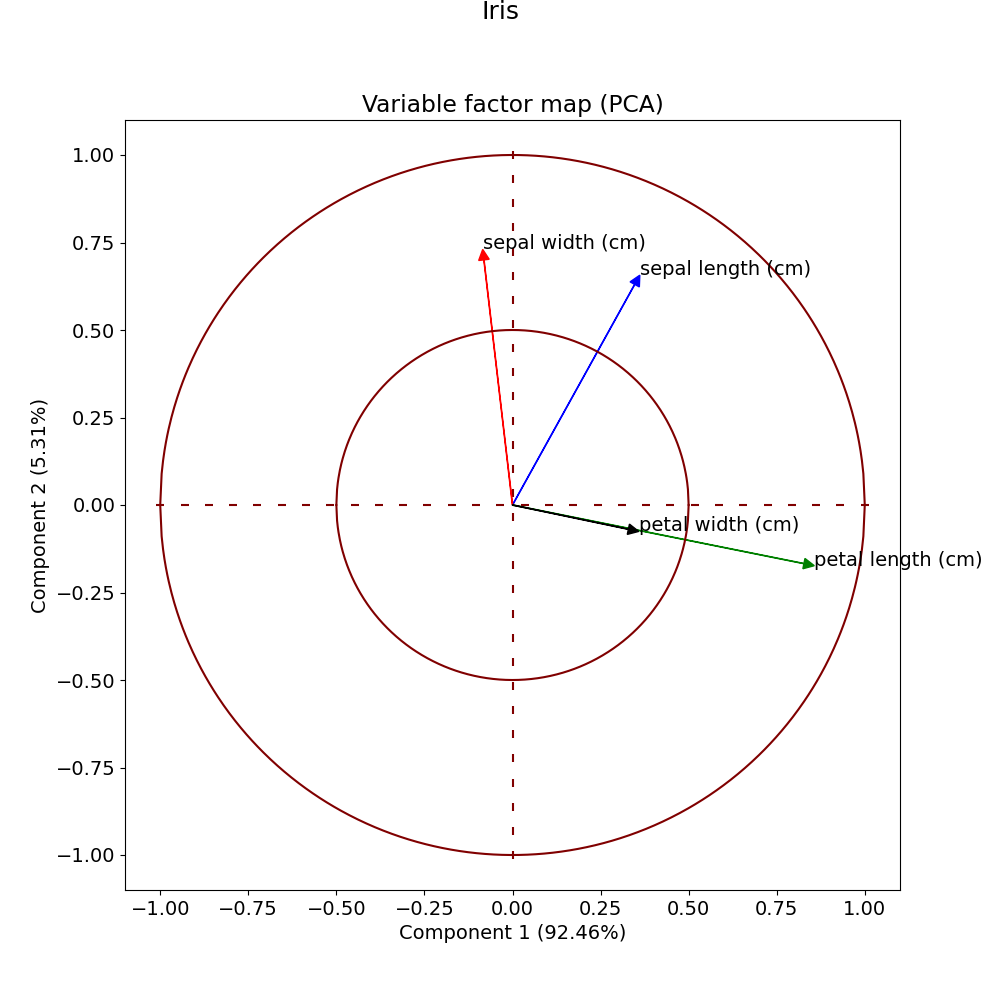
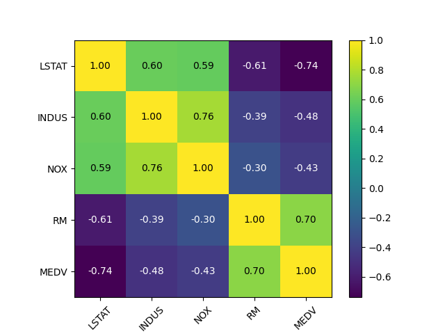
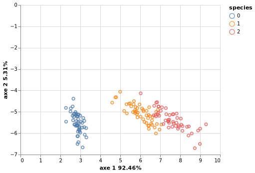

#  Python docker

Docker image builder for Quantitative analysis (QA)  
Embedding most used python modules

## Features

Compute
* Pca
* Lda
* Covariance
* Correlation
* ...
 
 Render
 * Scatter
 * Heatmap
 * Score plot
 * Correlation circle
 * ...

## Modules
* [numpy](https://numpy.org)
* [pandas](https://pandas.pydata.org/)
* [altair/altair_saver](https://altair-viz.github.io/)
* [sklearn](https://scikit-learn.org/stable/)
* [mlxtend](https://rasbt.github.io/mlxtend/)
* [matplotlib](https://matplotlib.org/)

Feel free to add your owns in **requirements.txt**.  
If changes => build.

## Npm packages
Some python modules required node libs to save figures, see **package.jon**.  
If changes => build.

## Sizes
* Python modules (460Mo)
* Node modules (250Mo)
* python:3.9-slim-bullseye image (250Mo)
* Debian extra packages (20Mo)

## Requirements
* Docker

## Build

Simply 
```
./build.sh
```

Clean exited containers
```
./clean.sh
```

## Run

Default user is pca change -u option to use root.

* Interractive

```
./runit.sh
```

* One shot

```
./run.sh
```

## Volumes

* Workspace is mounted on $HOME/pca

## Samples graphics

### Eigens visualisation

[:information_source: Understanding eigen vectors visualisation](./workspace/draweigens.py)
* Initial rectangle dashed.
* Projected rectangle filled.

Determining new plan axis with lines(e1,e2) from points (p1,Tp1) and (p2,Tp2).  



### Correlation circle

[:information_source: variable factor map](./workspace/vfmap.py)  
AKA variable factor map.  
Generated by mlxtend modules on iris dataset.  



### Heatmap

[:information_source: Heatmap](./workspace/heatmap.py)  
Generated by mlxtend modules on external housing dataset.



### Pca scatter

[:information_source: Scatter](./workspace/scatter.py)  
Generated by altair/altair_saver modules on iris dataset.


